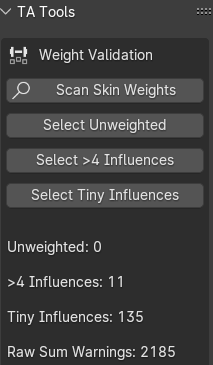
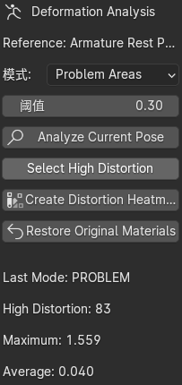
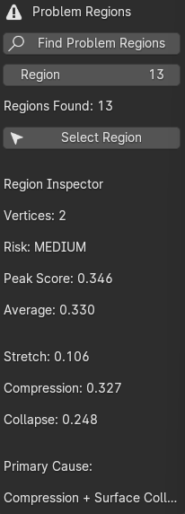

# Blender Skin Deformation Validator

A Blender technical art tool for validating skin weights, analysing pose deformation, and identifying potential deformation problems on rigged characters.

The tool was developed after encountering deformation issues while rigging and posing a stylised character. Instead of inspecting skin weights and problematic joints entirely by hand, I wanted to explore a reusable diagnostic workflow that could help artists quickly locate areas that may require attention.

The current version focuses on **diagnosis and visualisation rather than automatic correction**, keeping the artist in control of the final skinning and deformation decisions.

---

## Features

### Skin Weight Validation

Scans the selected skinned mesh for common weighting issues:

- Unweighted vertices
- More than four meaningful bone influences
- Tiny residual influences
- Raw weight-sum warnings
- Automatic vertex selection for inspection



---

### Pose Deformation Analysis

Compares the evaluated mesh in the current pose against the armature rest pose and analyses local deformation.

Available analysis modes:

- **Combined** — overall local edge deformation
- **Stretch** — detects local surface stretching
- **Compression** — detects local compression
- **Surface Collapse** — detects triangle area loss
- **Problem Areas** — combines multiple deformation signals into a diagnostic risk score

The analysis can be visualised directly on the character using a generated heatmap.



---

### Problem Area Detection

The Problem Areas mode combines several deformation measurements:

- Stretch
- Compression
- Surface collapse
- Interaction between compression and collapse

This produces a heuristic score designed to highlight areas that may require closer inspection.

The score is intended as a **diagnostic signal rather than a definitive error classification**, since deformation that is correct for one character or pose may be undesirable for another.

---

### Problem Region Inspector

High-risk vertices can automatically be grouped into connected problem regions.

For each detected region, the tool reports:

- Vertex count
- Risk level
- Peak problem score
- Average problem score
- Stretch contribution
- Compression contribution
- Surface collapse contribution
- Likely primary cause

Individual regions can then be selected directly in Blender for further inspection or manual weight editing.



---

## Workflow

1. Select a rigged mesh with an Armature modifier.
2. Open **TA Tools** from the 3D View sidebar.
3. Run **Skin Weight Validation** to check bone influences.
4. Pose the character.
5. Run **Deformation Analysis**.
6. Choose an analysis mode and threshold.
7. Generate a heatmap to visualise deformation.
8. Run **Find Problem Regions** to identify connected high-risk areas.
9. Select individual regions for closer inspection and manual correction.

---

## How the Deformation Analysis Works

The tool evaluates the mesh in both:

- Armature Rest Pose
- Current Pose

Local edge lengths are compared between the two states.

For an edge with rest length `Lr` and posed length `Lp`:

```text
Stretch = Lp / Lr - 1
```

when the edge becomes longer, while compression is calculated using the inverse ratio when the edge becomes shorter.

Surface collapse is estimated from triangle area loss:

```text
Collapse = max(0, 1 - CurrentArea / RestArea)
```

Local vertex scores combine average neighbourhood deformation with the strongest nearby deformation signal.

The **Problem Areas** mode then combines stretch, compression and surface collapse into a heuristic diagnostic score.

This is intended to prioritise suspicious regions for artist inspection rather than determine whether a deformation is objectively incorrect.

---

## Heatmap

The generated heatmap provides a visual representation of deformation severity relative to the selected threshold.

Approximate interpretation:

```text
Blue    → Low deformation
Cyan    → Increasing deformation
Yellow  → Around warning threshold
Orange  → High deformation
Red     → Severe deformation
```

The original materials can be restored from the TA Tools panel after inspection.

---

## Installation

This project is currently distributed as a Blender Python script.

1. Download `ta_deformation_validator.py`.
2. Open Blender.
3. Go to the **Scripting** workspace.
4. Open the script in the Text Editor.
5. Click **Run Script**.
6. Open the 3D View sidebar with `N`.
7. Select the **TA Tools** tab.

---

## Requirements

- Blender
- Python API included with Blender
- A mesh using an Armature modifier
- Deform bone vertex groups

No external Python packages are required.

---

## Current Limitations

- Deformation analysis requires the evaluated mesh topology to remain consistent between the rest pose and current pose.
- Surface collapse can also occur during intentional joint folding, so it should be treated as an inspection signal rather than proof of incorrect skinning.
- Problem scoring is heuristic and may require different thresholds depending on the character and pose.
- The tool currently identifies potential problems but does not automatically modify skin weights.
- Results are intended to assist artist judgement rather than replace manual deformation review.

---

## Future Development

Possible future improvements include:

- More detailed per-region diagnostics
- Bone influence inspection for detected problem regions
- Suggested weight adjustments
- Region-based before/after comparison
- Configurable analysis presets
- Improved artist-facing UI
- Packaging the script as a Blender add-on
- Testing across characters with different topology and rig structures

---

## Project Motivation

This project began while debugging skinning and deformation issues on one of my own Blender characters.

Extreme poses, particularly around joints such as elbows and shoulders, made it difficult to determine whether a visible problem was primarily caused by skin weights, compression, topology, or expected deformation from the pose itself.

I built this tool to explore how those signals could be measured and presented as an artist-facing debugging workflow.

The broader goal is to combine **character art, rigging knowledge, real-time graphics concepts, and scripting** into tools that make technical art workflows easier to inspect and iterate on.

---

## Status

Work in progress.

The current version implements the core validation, deformation analysis, heatmap visualisation, problem scoring, and region inspection workflow.