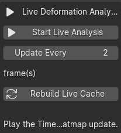

# Blender Skin Deformation Validator

A Blender technical art tool for validating skin weights, analysing character deformation, and identifying potential deformation problems on rigged characters.

The tool was developed after encountering deformation issues while rigging, posing, and animating a stylised character. Instead of inspecting skin weights and problematic joints entirely by hand, I wanted to explore a reusable diagnostic workflow that could help artists locate areas that may require attention.

The current version focuses on **diagnosis and visualisation rather than automatic correction**, keeping the artist in control of final skinning and deformation decisions.

---

## Features

### Skin Weight Validation

Scans the selected skinned mesh for common weighting issues:

- Unweighted vertices
- More than four meaningful bone influences
- Tiny residual influences
- Raw weight-sum warnings
- Automatic vertex selection for inspection

---

### Pose Deformation Analysis

Compares the evaluated mesh in the current pose against the armature rest pose and analyses local deformation.

Available analysis modes:

- **Combined** — overall local edge deformation
- **Stretch** — detects local edge stretching
- **Compression** — detects local edge compression
- **Surface Collapse** — detects triangle area loss
- **Problem Areas** — combines multiple deformation signals into a diagnostic risk score

The analysis can be visualised directly on the character using a generated heatmap.

---

### Live Deformation Analysis

Deformation can be analysed continuously during animation playback.

When Live Analysis is enabled, the tool caches rest-pose geometry data and updates the deformation heatmap as the animation plays. This makes it possible to observe when and where deformation risk develops during motion rather than inspecting poses one frame at a time.

Features include:

- Live deformation heatmap during timeline playback
- Cached rest-pose edge lengths and triangle areas
- Live Combined, Stretch, Compression, Surface Collapse, and Problem Areas modes
- Adjustable frame update interval for performance
- Manual cache rebuilding after mesh or rig changes
- Problem Region inspection after pausing on a suspicious frame

---

### Problem Area Detection

The **Problem Areas** mode combines several deformation measurements:

- Stretch
- Compression
- Surface collapse
- Interaction between compression and surface collapse

This produces a heuristic score designed to highlight areas that may require closer inspection.

The score is intended as a **diagnostic signal rather than a definitive error classification**, since deformation that is correct for one character, rig, or pose may be undesirable for another.

---

### Problem Region Inspector

High-risk vertices can automatically be grouped into connected problem regions.

For each detected region, the tool reports:

- Vertex count
- Risk level
- Peak problem score
- Average problem score
- Stretch contribution
- Compression contribution
- Surface collapse contribution
- Likely primary cause

Individual regions can then be selected directly in Blender for closer inspection and manual correction.

---

## Workflow

1. Select a rigged mesh with an Armature modifier.

2. Open **TA Tools** from the 3D View sidebar.

3. Run **Skin Weight Validation** to check for potential skinning issues such as unweighted vertices, excessive bone influences, and tiny residual influences.

4. Choose a **Deformation Analysis** mode:
   - Problem Areas
   - Stretch
   - Compression
   - Surface Collapse
   - Combined

5. Set an appropriate deformation threshold.

6. Analyse deformation using either workflow:

   **Static Pose Analysis**
   - Move to or create a pose you want to inspect.
   - Run **Analyze Current Pose**.
   - Generate the deformation heatmap to visualise high-risk areas.

   **Live Animation Analysis**
   - Click **Start Live Analysis**.
   - Play the animation in the Blender timeline.
   - The deformation heatmap updates as the character moves.
   - Adjust **Update Every N Frames** if necessary for performance.

7. When suspicious deformation appears during Live Analysis, pause the animation on that frame.

8. Run **Find Problem Regions** to cluster connected high-risk vertices into individual regions.

9. Use the **Problem Region Inspector** to examine:
   - Risk level
   - Peak and average problem scores
   - Stretch
   - Compression
   - Surface collapse
   - Primary deformation cause

10. Select individual problem regions for closer inspection and manual skin-weight or rigging correction.

11. If the mesh or rig has been modified, use **Rebuild Live Cache** before continuing Live Analysis.

12. Use **Restore Original Materials** when deformation visualisation is no longer needed.

---

## How the Deformation Analysis Works

The tool compares evaluated character geometry against the armature rest pose.

For static analysis, the mesh is evaluated in both the rest pose and current pose. For Live Analysis, rest-pose measurements are cached and only the current animated pose needs to be evaluated during subsequent frame updates.

### Edge Deformation

For an edge with rest length `Lr` and posed length `Lp`, stretching is measured from the relative increase in edge length:

`Stretch = Lp / Lr - 1`

When an edge becomes shorter than its rest length, compression is measured using the inverse ratio:

`Compression = Lr / Lp - 1`

### Surface Collapse

Surface collapse is estimated from triangle area loss:

`Collapse = max(0, 1 - CurrentArea / RestArea)`

Local vertex scores combine average neighbourhood deformation with the strongest nearby deformation signal.

### Problem Score

The **Problem Areas** mode combines stretch, compression, surface collapse, and an additional interaction term between compression and collapse into a heuristic diagnostic score.

This score is intended to prioritise suspicious regions for artist inspection rather than determine whether deformation is objectively incorrect.

---

## Heatmap

The generated heatmap provides a visual representation of deformation severity relative to the selected threshold.

Approximate interpretation:

- **Blue** → Low deformation
- **Cyan** → Increasing deformation
- **Yellow** → Around warning threshold
- **Orange** → High deformation
- **Red** → Severe deformation

During Live Analysis, the same heatmap is updated as the animation plays, making changes in deformation risk visible over time.

The original materials can be restored from the TA Tools panel after inspection.

---

## Installation

This project is currently distributed as a Blender Python script.

1. Download `ta_deformation_validator.py`.
2. Open Blender.
3. Go to the **Scripting** workspace.
4. Open the script in the Text Editor.
5. Click **Run Script**.
6. Open the 3D View sidebar with `N`.
7. Select the **TA Tools** tab.

---

## Requirements

- Blender
- Python API included with Blender
- A mesh using an Armature modifier
- Deform bone vertex groups

No external Python packages are required.

---

## Current Limitations

- Deformation analysis requires the evaluated mesh topology to remain consistent between the rest pose and current pose.
- Surface collapse can also occur during intentional joint folding, so it should be treated as an inspection signal rather than proof of incorrect skinning.
- Problem scoring is heuristic and may require different thresholds depending on the character, topology, rig, and pose.
- Live Analysis introduces additional per-frame mesh evaluation cost. More complex characters may require a larger update interval for responsive playback.
- Rest-pose data should be rebuilt after relevant mesh or rig changes before continuing Live Analysis.
- The tool currently identifies potential problems but does not automatically modify skin weights.
- Results are intended to assist artist judgement rather than replace manual deformation review.

---

## Future Development

Possible future improvements include:

- More detailed per-region diagnostics
- Bone influence inspection for detected problem regions
- Weight-adjustment guidance
- Region-based before/after comparison
- Configurable analysis presets
- Improved artist-facing UI
- Packaging the script as a Blender add-on
- Testing across characters with different topology and rig structures
- Performance optimisation for Live Analysis

---

## Project Motivation

This project began while debugging skinning and deformation issues on one of my own Blender characters.

Larger and more extreme poses, particularly around joints such as the elbows and shoulders, made it difficult to determine whether a visible problem was primarily caused by skin weights, compression, topology, or expected deformation from the pose itself.

After beginning with static pose analysis, I extended the tool with Live Deformation Analysis so that deformation risk could be visualised while the character was actually moving.

The project explores how deformation signals can be measured and presented as an artist-facing debugging workflow rather than relying entirely on manual inspection.

The broader goal is to combine **character art, rigging knowledge, graphics concepts, and scripting** into tools that make technical art workflows easier to inspect and iterate on.

---

## Status

Work in progress.

The current version implements skin-weight validation, static pose deformation analysis, live deformation analysis during animation playback, heatmap visualisation, heuristic problem scoring, connected problem-region detection, and region-level inspection.